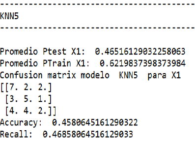

# **Machine Learning Algorithm to predict football/soccer matches results of team _Deportivo Guadalajara (Chivas)_** 

## Abstract
>The scope of this project was gathering public data related to previous matches played by soccer team _Guadalajara_ in order to predict the outcome of upcoming matches by applying Data cleaning, transformations, Feature Engineering, Feature Selection and Machine Learning model tuning techniques. In order to evaluate different model performances, histograms were used to display test and train accuracies obtained by running classification algorithm several times.

|Project General Info|Project Specs|
|--|--|
|<table> <tr><th>Field</th><th>Value</th></tr><tr><td>_Created By_</td><td>Marco Casillas</td></tr><tr><td>_Creation Date_</td><td>Sep 10th 2019</td></tr><tr><td>_Last Update Date_</td><td>February 10th,2023</td></tr><tr><td>_Project Name_</td><td>Football/Soccer Machine Learning Matches Prediction</td></tr></table>|<table> <tr><th>Field</th><th>Value</th></tr><tr><td>_Football Team_</td><td>Club Deportivo Guadalajara</td></tr><tr><td>_League_</td><td>Liga MX</td></tr><tr><td>_Country_</td><td>Mexico</td></tr><tr><td>_IDE_</td><td>Spyder</td></tr><tr><td>_Python Version_</td><td>3.7.3</td></tr></table>|

## Data Gathering

The data used to feed this algorithm consisted on data collections from pages such as [Transfermarkt](https://www.transfermarkt.es/liga-mx-apertura/startseite/wettbewerb/MEXA), [MedioTiempo.com](https://www.mediotiempo.com/futbol/liga-mx/guadalajara) and [LigaMX](https://https://ligamx.net/cancha/estadisticahistorica). Some examples of the features used for this analysis are:

- Goals Scored and received
- Goal difference (Goals scored minus goals received) 
- Number of played games
- Number of losses, draws and wins
- Percentage of points obtained
- Draw, win and loss streaks in the previous 5, 4, 3 and 2 games
- Data from team's head coach:
    - Number of consecutive games on the team
    - Number of preseasons as team's head coach
- Distance traveled when playing as the away team
- Difference between teams' estimated economic value
- Difference between teams' average age
- Unbeaten streak of home and away team

A lot of these these variables were compared with the ones from the next rival team, and against the latest 5 opponents. 

## Feature Extraction and Selection

A dataset containing more than 170 variables was created by gathering this information and generating some
other characteristics by deduction and/or combining existing variables. Data Cleaning was also required: records that had missing info about the rival team had to be removed.

After making sure data was consistent and  complete and missing values were handled properly through data transformation, diverse techniques for analysis and feature selection were used: _Wrapper methods, Mutual Information and Maximal Information Coefficient_. Data would be splitted on test and training subsets, and accuracy histograms showing the train and test accuracy during several iterations were displayed after using different classifier Machine Learning methods. However, accuracy for the test subset remained around 35% on any approach:

>Left side: Wrapper techniques accuracy results.
>    - Blue Histogram shows behaviour before adding wrapper variables
>    - Red  Histogram shows behaviour after  adding wrapper variables
>    - There was no significant accuracy improvement
>
>Right Side: Maximal Information Coefficient Accuracy Histogram. 
>    - Red Histogram  for  Top 15 most significant variables 
>    - Blue Histogram for  Top 10 most significant variables
>    - Green Histogram shows accuracy when all variables are being used
>    - This also shows no signs of significant accuracy improvement 

### Maximal Information Coefficient

Maximal Information Coefficient method was used because it would allow greater flexibility in the distribution of the data. This feature selection algorithm improved  the training accuracy by using the top 20 significant features.

>The effect of each independent variable was numerically represented, so that variables with minimal effect on the outcome, like the ones showed on the above picture, could be discarded.

### Principal Component Analysis(PCA)

Since a good enough accuracy was not obtained with the previous approach, the next approach was reducing the number of features by creating synthetic characteristics with the PCA algorithm. The graph obtained when trying to reduce to 2 components showed a distribution that could hardly successfully separate the 3 classes (Win, draw, Defeat), but the accuracy obtained was similar than the previous Maximal Information approach.

>The scatter plot above shows that this technique is not classifying the matches outcomes successfully.

The next step was to use the best 20 variables selected by the Maximal Information Coefficient as input for  3-component Principal Component Analysis or PCA in combination with a 5-neighbor K-Nearest Neigbors classification algorithm. This configuration gave the best accuracy results: a train accuracy greater than 60% and a Testing accuracy close to 50%:

>Accuracy Comparison between 3 different neighbor configurations. By using 5 neighbors on the KNN algorithm, a significant average accuracy is obtained on train and test datasets

>Train (Blue) and Test (Red) Accuracy Histograms. Obtained by several iterations of randomly splitting data into test and train datasets, running the KNN model and measuring accuracy of the prediction.

Other options were tested, such as a 2-component PCA algorithm ,a 4-component PCA, and 3-component PCA technique in combination with diverse classification algorithms. None of those alternatives were best than the 3-components PCA, 5-neighbor KNN classifier configuration.
  

>Confusion matrices and accuracy and recall indexes were also observed. 

## Some Data Insights

Some other interesting insights can be discovered when using scatter plots to look for correlation:

> Left side:  Red dots represent a game that Guadalajara lost. There seems to be a high defeat frequency when Guadalajara faces a team with a similar estimated aconomic value, specially when the head coach has not been  on the team for too long. Of course, most of the matches against a team with a significantly higher economic  value also ended on defeat.
>
> Right side: When the head coach has been on the team of at least 40 matches, which suggests he is doing his job in a proper way, there is a small amount of defeats, specially when playing against a team with a higher  average age(see zone inside yellow square). This plot shows two things: is not common for a manager to stay too long in the team, and the average age difference between teams is usually small. Perhaps using younger players would give positive results: there is a good amount of won matches (green dots) when facing an older team. 

## Future improvements for version 2.0

There is a lot of space for improvement in this project. 

Regarding Architecture

- [ ] Divide data in tables for faster query times and better analysis
- [ ] Store tables in a cloud-based database
- [ ] Find APIs that automatically provide updated info regarding new games

Regarding Data
- [ ] Obtain updated data for 2023
- [ ] Include all the rival team information as new features
- [ ] Include bookmaker and betting shops information as new model features
- [ ] Record how many injured/sent off players do the teams have, specially if those players are usually on the starting lineup
- [ ] Substitution data (Value of player entering the field, number of minutes previously played...)

Regarding scripting
- [ ] Python scripts to get data from APIs and Web Scraping methods
- [ ] ETL and automated, scheduled jobs 
- [ ] Integrate everything to a Databricks, MLFlow or AWS based service
- [ ] Display everything on a web page (Django or Flask based)